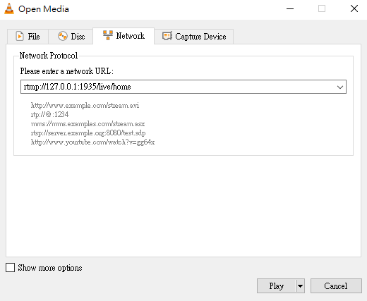
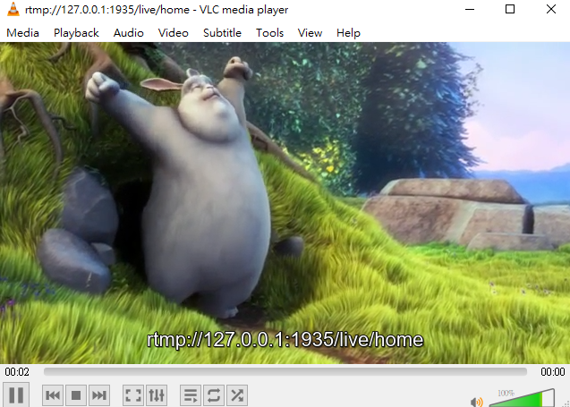

# Description
Use C++, RTMP protocol and FFmpeg to push video streams, and use VLC to receive and play HTTP streams.

This project is simple to show how to use ffmpeg & RTMP to push video streaming.
# Documentation
[You can find for more details form my notion.](https://www.notion.so/Windows-FFmpeg-RTMP-video-streaming-nginx-VLC-be66d3543ec64d73a60897aa086a58ca)

# Getting Started
## Environment
### Compiler
|Win 10|Ubuntu 1604|
|:--:|:--:|
### Open Sources
* nginx 1.7.11.3 Gryphon
    1. **nginx 1.7.11.3 Gryphon:** to http://nginx-win.ecsds.eu/download/ download "nginx 1.7.11.3 Gryphon.zip"
    2. **nginx-rtmp-module:** https://github.com/sergey-dryabzhinsky/nginx-rtmp-module
* FFmpeg
    Source Code: https://www.ffmpeg.org/download.html
    GIthub Windows build: [BtbN/FFmpeg-Builds](https://github.com/BtbN/FFmpeg-Builds#auto-builds)
* VLC
    https://www.videolan.org/
* Sample flv
    sample flv video: https://sample-videos.com/
## Installation
[You can find for more details form my notion.](https://www.notion.so/Windows-FFmpeg-RTMP-video-streaming-nginx-VLC-be66d3543ec64d73a60897aa086a58ca)

## video_to_rtmp
### Description
Use C++, RTMP protocol and FFmpeg to push a local flv video stream, and use VLC to live HTTP streams.

This project is simple to show how to use ffmpeg & RTMP to push video streaming.

### API
#### GetFileStreamInfo
* Function
    1. avformat_open_input():
        * Allocate memory to the component **AVFormatContext \*in**
        * Open the file and read its header and fill the **AVFormatContext** with minimal information about the format.
    2. avformat_find_stream_info():
        * To access the streams, we need to read data from the media. Throught this function, **in->nb_streams** will hold the amount of streams and **in->streams[i]** will return the i stream. 
* Method
    ```
    /**
    * @param input_format_context   AVFormatContext type input ptr.       
    * @param file_path              input file path.
    * @return                       0:ok; -1:error
    **/
    int GetFileStreamInfo(AVFormatContext*& input_format_context, const char* file_path);
    ```
#### CreateAVFormatContextInstance
* Description

* Function
    1. avformat_alloc_output_context2():
        * Allocate memory to **AVFormatContext \*output_format_context**
        * According to **format_type** to fill the **AVFormatContext** with minimal information about the format.
* Method
    ```
    /**
     * @param output_format_context     AVFormatContext output ptr.
     * @param format_type               video format
     * @param out_url                   RTMP URL
     * @return                          0:ok; -1:error
    **/
    int CreateAVFormatContextInstance(AVFormatContext *&output_format_context, const char *format_type, const char *out_url);
    ```
#### CreateOutputStream
* Function
    1. avcodec_find_encoder():
        Find the input_format_context codec ID(AVCodec).
    2. avformat_new_stream():
        To create new out stream into our output format context.
    3. avcodec_parameters_copy():
        Copy the contents of src to dst.
* Method
    ```
    /**
     * @param           AVFormatContext input ptr.
     * @param           AVFormatContext output ptr.
     * @return          0:ok; -1:error
    **/
    int CreateOutputStream(AVFormatContext*& input_format_context, AVFormatContext*& output_format_context);
    ```
#### CreateAndInitAVIOContext
* Description
    Create the output file.
* Function
    1. avio_open():
        * Create and initialize a AVIOContext for accessing the resource indicated by url.
    2. avformat_write_header():
        * Allocate the stream private data and write the stream header to an output media file
* Method
    ```
    /**
     * @param output_format_context     AVFormatContext output ptr.
     * @param url                       output file name.
     * @return                          0:ok; -1:error
    **/
    int CreateAndInitAVIOContext(AVFormatContext*& output_format_context, const char* url);
    ```
#### Remuxing
* Description
    Remuxing is the act of changing from one format (container) to another. (allows an Elementary stream to be divided into packets)(transport stream).
    Copy the streams, packet by packet, from our input to our output streams. 
* Function
    1. av_read_frame():
        Feed packets(AVPacket) from the stream while it has packets.
    2. av_rescale_q_rnd():
        Rescale a 64-bit integer by 2 rational numbers with specified rounding.The operation is mathematically equivalent to `a * bq / cq`.
    3. av_interleaved_write_frame():
        Write a packet to an output media file ensuring correct interleaving.This function will buffer the packets internally as needed to make sure thepackets in the output file are properly interleaved in the order ofincreasing dts.
* Method
    ```
    /**
     * @param input_format_context      AVFormatContext intput ptr.
     * @param output_format_context     AVFormatContext output ptr.
     * @return                          0:ok; -1:error
    **/
    int Remuxing(AVFormatContext*& input_format_context, AVFormatContext*& output_format_context);
    ```

# Demo
1. According to nginx-1.7.11.3-Gryphon\conf\nginx-win.conf, ours RTMP URL is "rtmp://127.0.0.1:1935/live/home".
2. Open VLC.exe -> Playback -> Play -> Network -> enter the URL: rtmp://127.0.0.1:1935/live/home -> Play

3. Run your executable file (bin\Release\video_to_rtmp.exe)
And VLC media play will receive packgets
